# LOOMWIRE

**Turn an idea into a protected cultural system.**

LOOMWIRE is an AI-powered brand operating system for creators, founders,
fashion brands, artists, musicians, designers, and startups. It moves a raw
idea through naming, IP preparation, visual identity, product blanks, lookbook
creation, launch planning, and archive records.

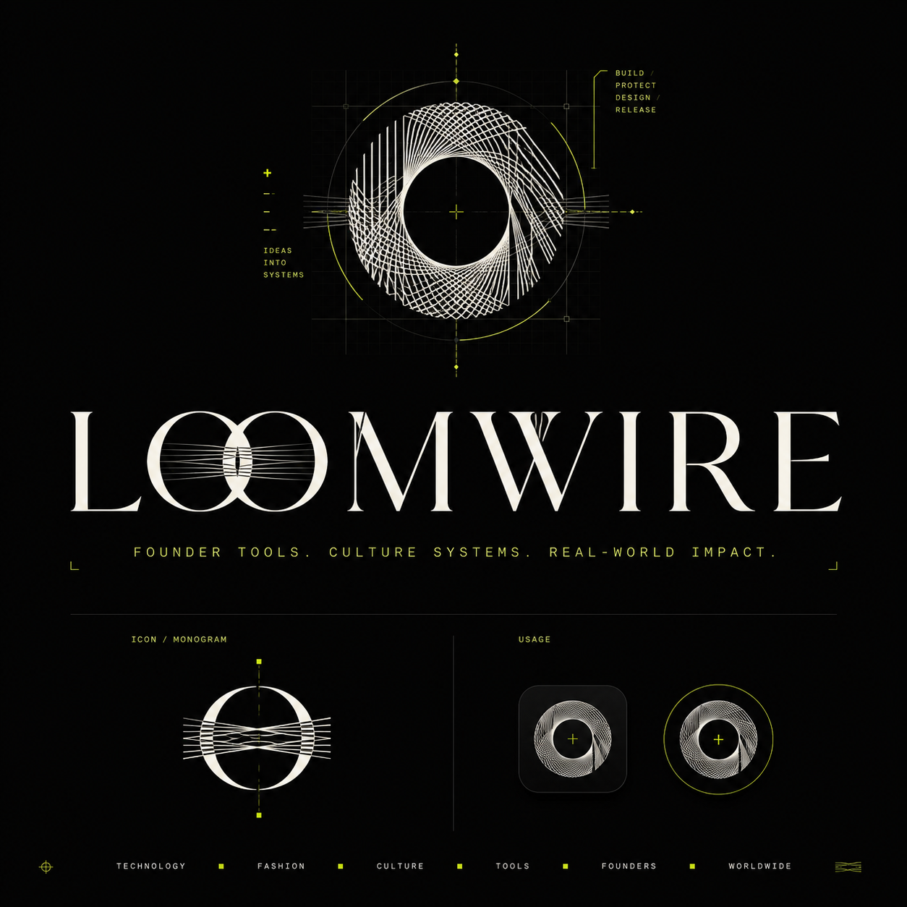

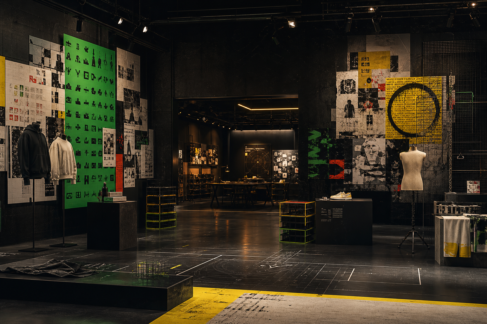

## Preview

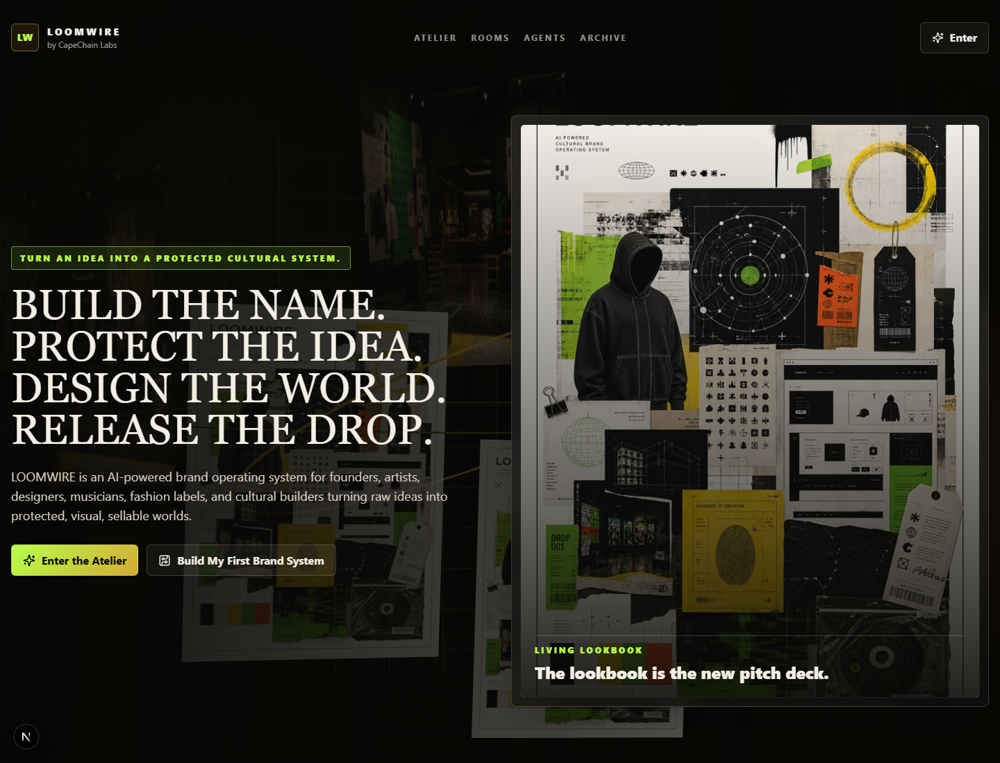

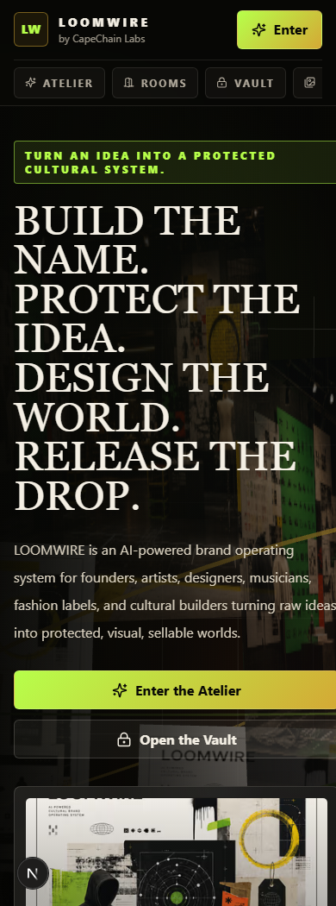

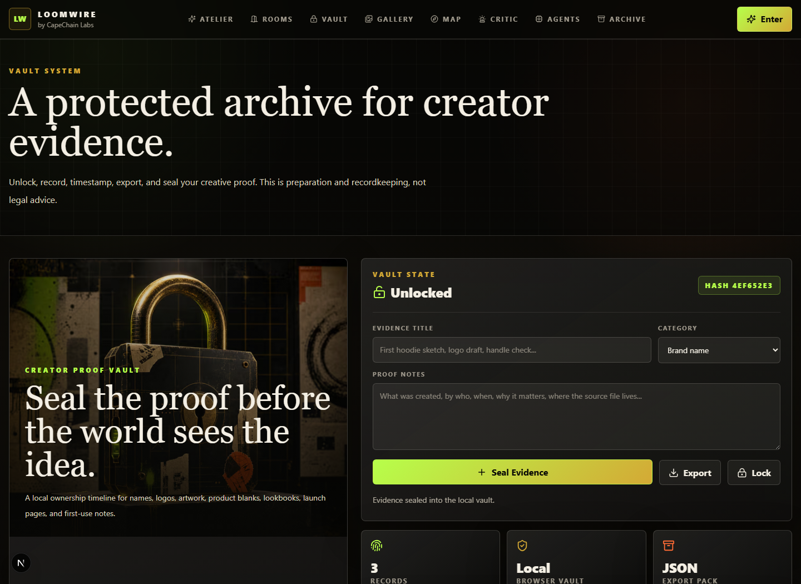

| Gallery | Cultural Map | Brand Critic |
| --- | --- | --- |
| 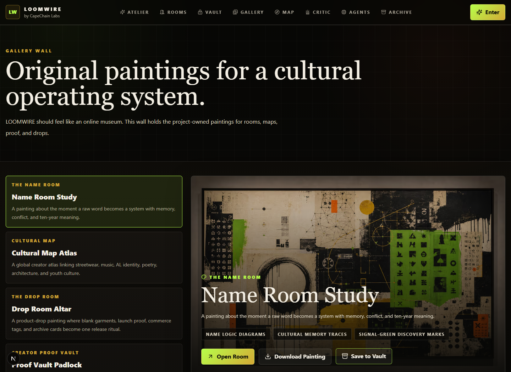 | 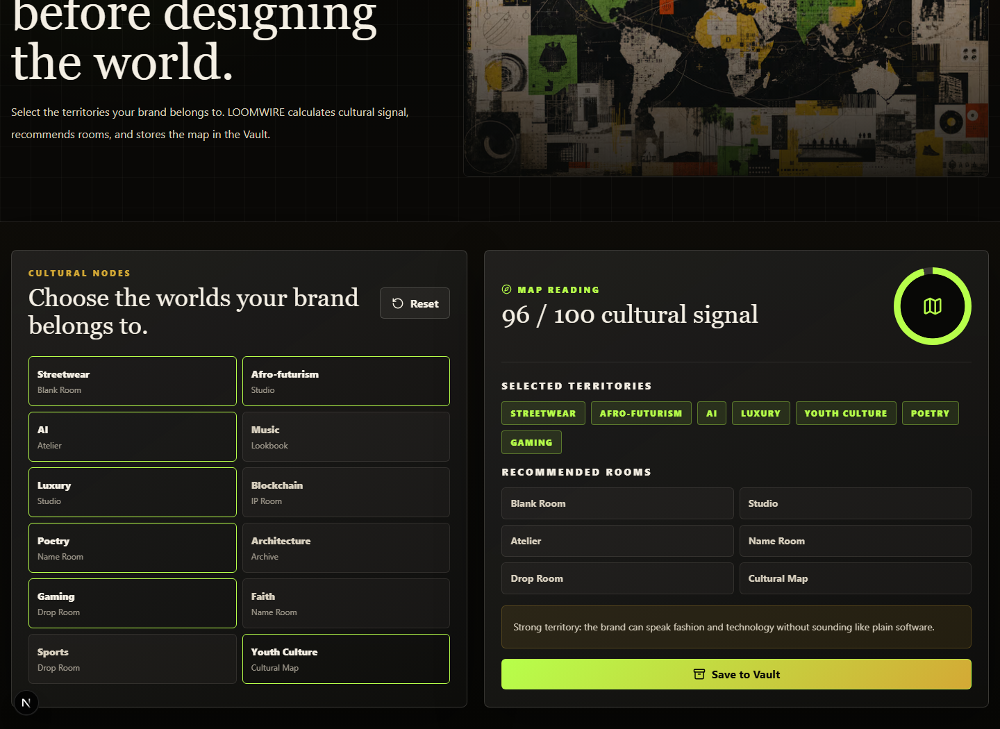 | 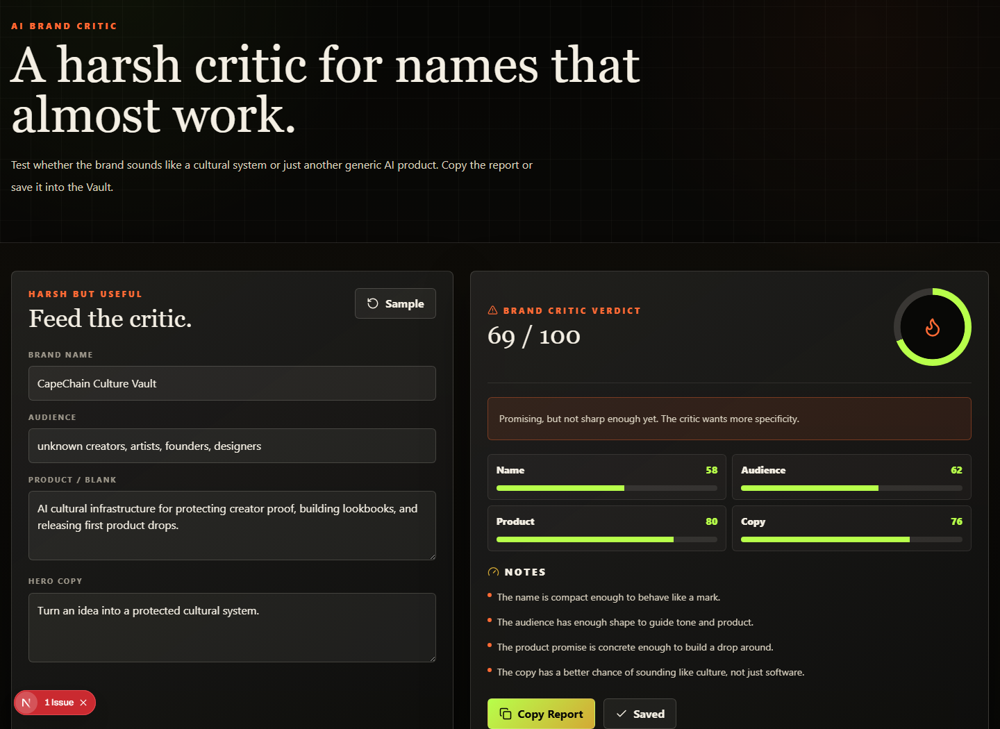 |

## Original Gallery

| Name Room | Cultural Map | Drop Room |
| --- | --- | --- |
| 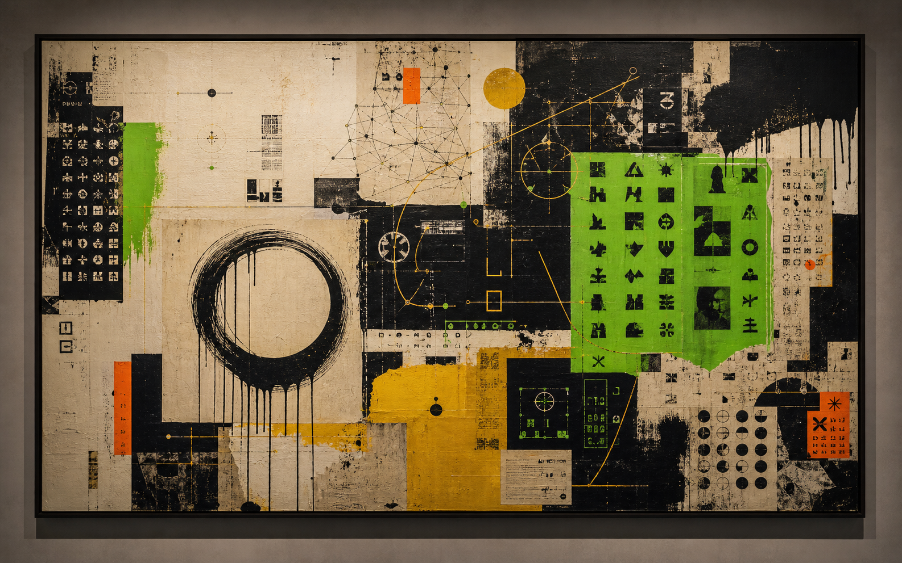 | 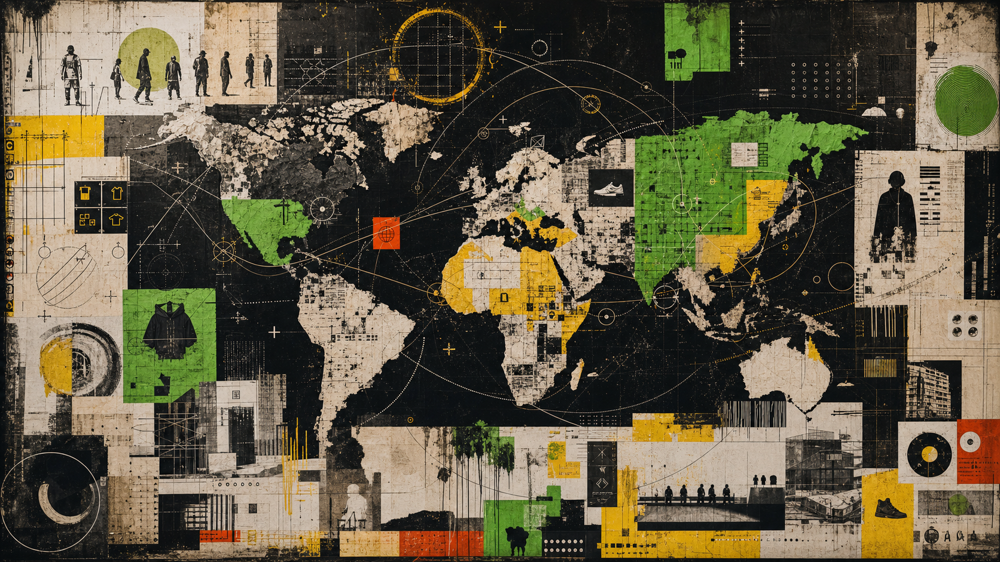 | 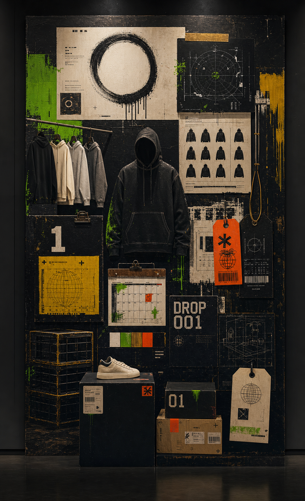 |

## What It Does

- Generates brand name options with meaning, slogan, and risk notes.
- Builds a manifesto, positioning, color system, logo prompt, and website hero.
- Creates an IP preparation checklist and creator evidence pack.
- Adds a dedicated Creator Proof Vault with an artful padlock, unlock flow,
  synced/local evidence timeline, timestamps, and JSON export.
- Adds an original Gallery Wall with project-owned paintings and working
  download/save actions.
- Adds the official LOOMWIRE logo system across the app shell, homepage,
  browser metadata, and GitHub presentation.
- Adds an interactive Cultural Map that scores cultural signal and saves the
  selected territories to the Vault.
- Adds a working AI Brand Critic for name, audience, product, and copy checks.
- Adds a Launch Board that turns the latest Atelier system into release tasks,
  readiness scoring, drop math, JSON export, and Vault proof.
- Chooses a first product blank and turns it into a launchable drop.
- Produces a lookbook outline, social bio, launch plan, cultural map, and Brand DNA Score.
- Supports bring-your-own-key AI lanes for OpenAI, Claude, OpenRouter, and Groq.
- Includes a free local demo engine and an Ollama lane for local models.
- Includes Netlify release config, security headers, smoke tests, and a
  local-first Vault API backed by Netlify Blobs in production.

## Pages

- `/` - gallery-style entrance and product overview.
- `/atelier` - working Brand System Generator.
- `/rooms` - room index.
- `/rooms/name-room` - naming logic and story.
- `/rooms/ip-room` - IP preparation room.
- `/rooms/studio` - art direction room.
- `/rooms/blank-room` - first product blank strategy.
- `/rooms/lookbook-engine` - living lookbook and pitch-deck engine.
- `/rooms/drop-room` - launch and release strategy.
- `/vault` - Creator Proof Vault.
- `/gallery` - original paintings and artwork wall.
- `/cultural-map` - interactive cultural territory mapper.
- `/critic` - working brand critic and scorecard.
- `/launch-board` - release planner with tasks, scoring, commerce math, export, and Vault save.
- `/agents` - multi-agent system.
- `/archive` - version history and cultural memory.

## Product Rooms

- **The Name Room**: name logic, story, slogans, and identity.
- **The IP Room**: trademark prep, ownership records, and evidence packs.
- **The Studio**: visual direction, color, logos, posters, campaign ideas, and mockups.
- **The Blank Room**: the product surface where the brand first lives.
- **Lookbook Engine**: turns a brand system into a shoppable pitch deck.
- **The Drop Room**: release plan, pricing logic, audience, and content calendar.
- **The Archive**: version history for names, visuals, drops, and ownership proof.
- **Creator Proof Vault**: locked local archive for evidence records and export.

## AI Provider Model

LOOMWIRE is designed so users pay for their own AI usage when they choose paid
models. The UI can send a user-provided API key for a single request, or the user
can opt into browser-local key storage. Keys are not committed and are not
required for the built-in demo engine.

See [docs/AI_PROVIDERS.md](docs/AI_PROVIDERS.md) for the provider setup.

## Storage And Release

- [docs/STORAGE.md](docs/STORAGE.md) explains the local-first Vault sync model.
- [docs/RELEASE.md](docs/RELEASE.md) explains Netlify setup, env vars, and release checks.

## Getting Started

```bash
npm install
npm run dev
```

Then open [http://127.0.0.1:3000](http://127.0.0.1:3000).

## Checks

```bash
npm run typecheck
npm run build
npm run smoke
npm audit
```

## CapeChain Labs

Built by CapeChain Labs, LOOMWIRE is cultural infrastructure for the next
generation of founders, artists, designers, and creators.
